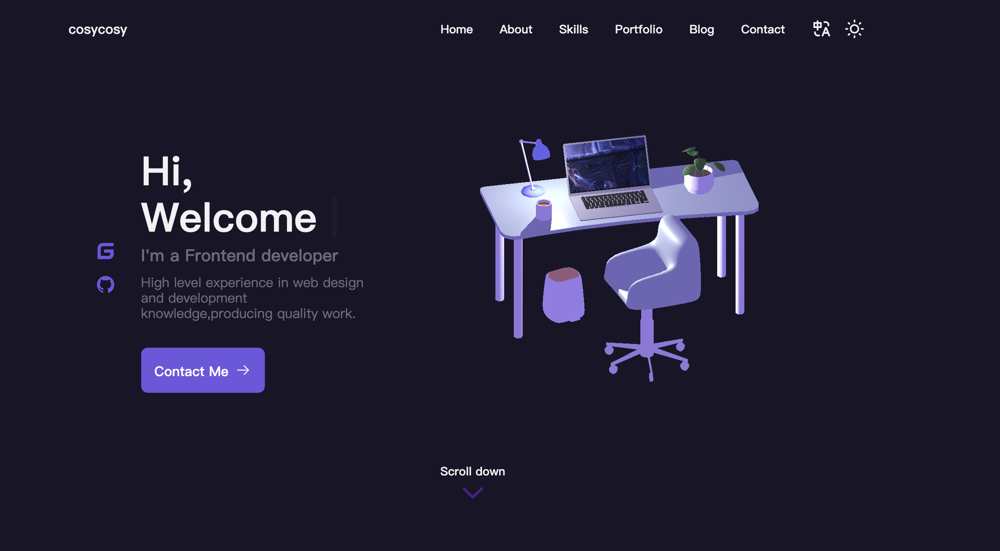

# my-protfolio-web

## 介绍

预览地址：https://portfolio.cosycosy.cn
原项目地址 https://gitee.com/asoutherncat/responsive-portfolio-website/tree/master

对原项目用vue进行了重写，并且主页结合threejs。


## Project setup
```
npm install
```

### Compiles and hot-reloads for development
```
npm run serve
```

### Compiles and minifies for production
```
npm run build
```

### Lints and fixes files
```
npm run lint
```

### Customize configuration
See [Configuration Reference](https://cli.vuejs.org/config/).
